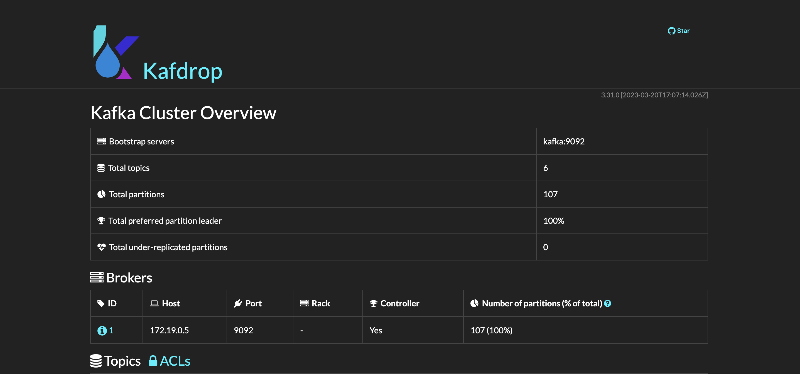

# kafka-stream-aggregates-example

kafka-streams을 이용한 코드 예제입니다.

## Data Flow


## Source/Sink Connector Configuration

- Kafka Source/Sink Connector 구현체로 [Debezium](https://debezium.io/)을 사용하고 있습니다.
- 각 설정에 대한 설명은 [Configuration](./config)를 참고하세요.

## Running The App

- [docker-compose](https://docs.docker.com/compose/install/)가 설치되어 있어야 합니다.
- 아래의 명령을 통해서 실행되는 어플리케이션들은 다음과 같습니다.
  - kafka
  - zookeeper
  - mysql/mongo
  - connectors (source/sink)
  - app (aggregates)
  - kafdrop (monitoring)

```bash
$ docker-compose up -d
$ docker-compose ps

                      Name                                   Command             State                                   Ports
---------------------------------------------------------------------------------------------------------------------------------------------
kafka_stream_aggregates_example_aggregator_1       /bin/bash -c                  Up
                                                     while ! cu ...
kafka_stream_aggregates_example_connect_sink_1     /docker-entrypoint.sh start   Up      0.0.0.0:8084->8083/tcp, 9092/tcp
kafka_stream_aggregates_example_connect_source_1   /docker-entrypoint.sh start   Up      0.0.0.0:8083->8083/tcp, 9092/tcp
kafka_stream_aggregates_example_kafdrop_1          /kafdrop.sh                   Up      0.0.0.0:9000->9000/tcp
kafka_stream_aggregates_example_kafka_1            /docker-entrypoint.sh start   Up      0.0.0.0:9092->9092/tcp
kafka_stream_aggregates_example_mongodb_1          docker-entrypoint.sh mongod   Up      0.0.0.0:27017->27017/tcp
kafka_stream_aggregates_example_mysql_1            docker-entrypoint.sh mysqld   Up      0.0.0.0:3306->3306/tcp, 33060/tcp
kafka_stream_aggregates_example_zookeeper_1        /docker-entrypoint.sh start   Up      0.0.0.0:2181->2181/tcp, 0.0.0.0:2888->2888/tcp, 0.0.0.0:3888->3888/tcp
```

### Source Connector Installation

- [start.connector.sh](./start.connector.sh)을 통해서 설치할 수 있습니다.

```bash
# usage) ./start.connector.sh [mysql|mongodb] [port] [source|sink]
$ ./start.connector.sh mysql 8083 source
```

### Sink Connector Installation

```bash
# usage) ./start.connector.sh [mysql|mongodb] [port] [source|sink]
$ ./start.connector.sh mongodb 8084 sink
```

## Kafka Monitoring

- [kafdrop](https://github.com/obsidiandynamics/kafdrop)을 활용하고 있습니다.
- `http://localhost:9000`에서 생성된 토픽과 메시지를 확인할 수 있습니다.

```bash
$ docker-compose up -d kafdrop
```


